# Date-Input Form Fields: UX Design Guidelines

* 날짜 입력 필드의 서식화는 작은 세부 사항처럼 보일 수 있지만, 잘못 구현된 경우 작은 상호 작용조차도 프로세스를 멈추게 할 수 있습니다.
* 날짜 입력의 부적절한 디자인은 사용자의 고민이나 불편함을 초래하며, 양식을 완전히 포기할 위험을 안게 합니다.
* 더 나쁜 경우에는 사용자가 잘못된 날짜를 지정하면 전체 거래가 재앙이 될 수 있습니다.
* 예를 들어, 극장에서 새로운 공연을 기대하고 티켓을 사러 갔지만 다른 날짜의 티켓을 샀을 때 어떤 기분일지 생각해보세요.

* 모바일 기기를 사용하는 사용자와 국제 관객을 고려해야 하며, 이 작고 중요한 입력을 개선하기 위한 고려 사항에 대해 이 글에서는 일반적인 입력 패턴, 오류 처리 및 국제적인 날짜 입력을 논의합니다.

## 날짜 입력 패턴

* 캘린더 선택기는 한 번에 전체 달력 월을 표시하는 컨트롤 요소입니다.
* 일반적으로 위쪽에는 요일을 표시하며, 책상이나 벽 달력의 의미를 일치시킵니다.

    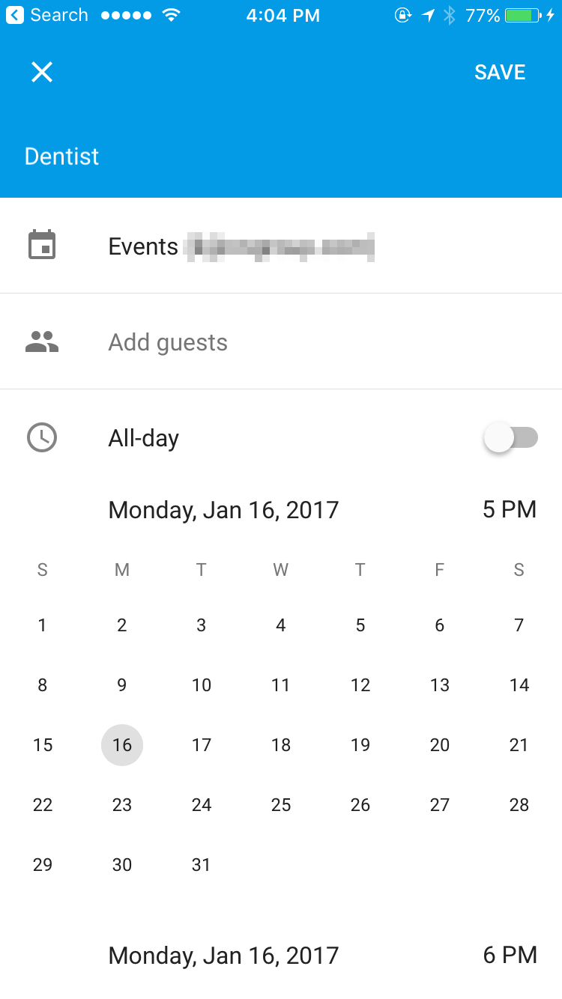

    <em>모바일에서 Google 캘린더 앱에서 보이는 캘린더 선택기의 예시</em>

* 캘린더 선택기는 현재 시간과 가까운 이벤트 - 1년 이내의 이벤트에 사용해야 합니다.
* 그러나 미래로 너무 먼 날짜를 선택하는 사용자에게는 너무 많은 탐색이 필요하여 원하는 입력으로 이동하기 어렵고, 이러한 사용자에게는 단순히 연도를 입력하는 것이 더 빠를 수 있습니다.

* 캘린더 선택기는 특히 날짜 범위를 선택할 때 특히 유용합니다.
* 이러한 상황에서는 종종 두 달을 나란히 표시합니다.

  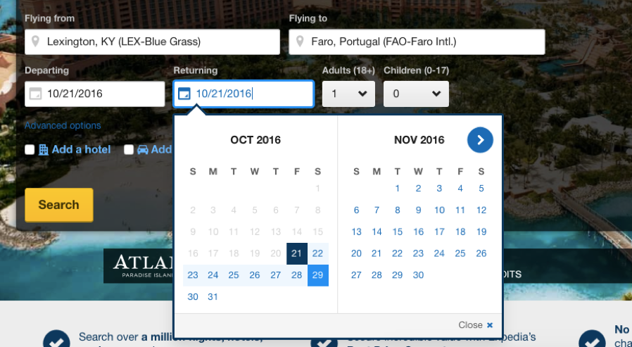

    <em>Expedia는 선택한 출발일과 귀국일의 날짜 범위를 나타내기 위해 연한 파란색 강조를 사용했습니다. 달력에서 출발일과 귀국일은 서로 다른 색상으로 표시됩니다.</em>

* 모바일 기기에서의 스크롤링 날짜 선택기
  * 모바일 기기에서의 스크롤링 날짜 선택기는 흔하지만, 선택기에 많은 날짜가 포함되어 있는 경우에는 불편할 수 있습니다.
  * 이러한 상황에서는 작은 공간에서 스크롤하는 것이 느리고 비생산적일 수 있으며, 사용자가 직접 날짜를 입력할 수 있도록 하는 것이 더 나을 수 있습니다.

  * Todoist 앱에서 사용자는 무한 스크롤 리스트를 사용하여 각 작업의 마감일을 입력할 수 있습니다.
  * 아래에 표시된 것처럼 마감일이 금요일이나 토요일에 발생하는 경우 문제가 되지 않지만, 마감일이 며칠 후라면 사용자가 직접 날짜를 입력하는 것이 더 쉽습니다 (이 기능은 앱에서도 제공됩니다).

  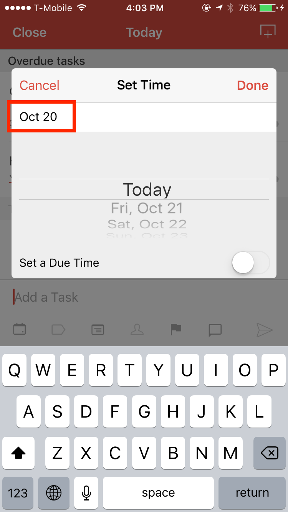

    <em> iPhone의 Todoist 앱은 사용자가 날짜를 입력할 때 스크롤 및 직접 입력할 수 있게 허용했습니다. ( "오늘:"이라는 현재 날짜를 표시하는 이점에 주목하세요. 사용자가 오늘의 날짜를 기억하지 못하는 경우 불확실성을 제거합니다.).</em>

* 월, 일 및 연도에 대한 드롭다운을 사용하여 날짜 필드를 분할
  * 월, 일 및 연도에 대한 드롭다운을 사용하여 날짜 필드를 분할하는 것은 많은 불필요한 단계를 필요로 합니다.
  * 이 방법은 클릭 및 스크롤 추가로 상호 작용 비용을 증가시킵니다. 이러한 패턴의 사용을 권장하지 않습니다.

  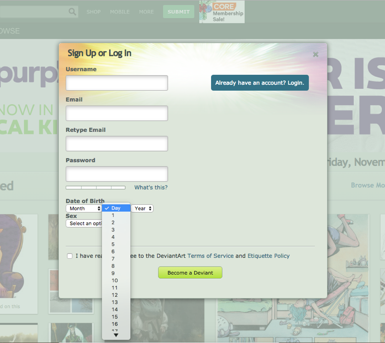

    <em>DeviantArt은 날짜 필드의 각 부분에 대한 드롭다운을 제공했습니다.</em>

* 날짜 입력을 직접 타이핑
  * 날짜 입력을 직접 타이핑하는 것은 날짜 입력에 대한 가장 기본적인 옵션이지만, 많은 경우에 가장 효율적인 방법 중 하나입니다.
  * 특히 날짜가 더 멀리 떨어져 있는 경우(예: 생년월일 또는 미래의 날짜)에는 허용하는 것을 권장합니다.
  * 다른 입력 방법이 제공되더라도 사용자가 날짜를 직접 입력할 수 있도록 권장합니다.

## Date-Input Design Guidelines

* 제한된 수의 날짜 옵션을 위한 목록 제공
  * 일부 경우에는 사용자가 선택할 수 있는 날짜가 매우 제한적일 수 있습니다.
  * 예를 들어, 온라인 쇼핑 서비스인 Google Express는 고객이 식료품을 온라인으로 주문하고 배송 시간을 예약할 수 있게 합니다.
  * 무한한 옵션의 빈 날짜 필드나 캘린더 선택기를 제공하는 대신, Google Express는 짧은 날짜 목록을 제공합니다.
  * 사용 불가능한 모든 날짜는 회색으로 표시되어 비활성화되었습니다. (또는 사용 불가능한 날짜는 목록에 포함되지 않을 수도 있습니다.)

  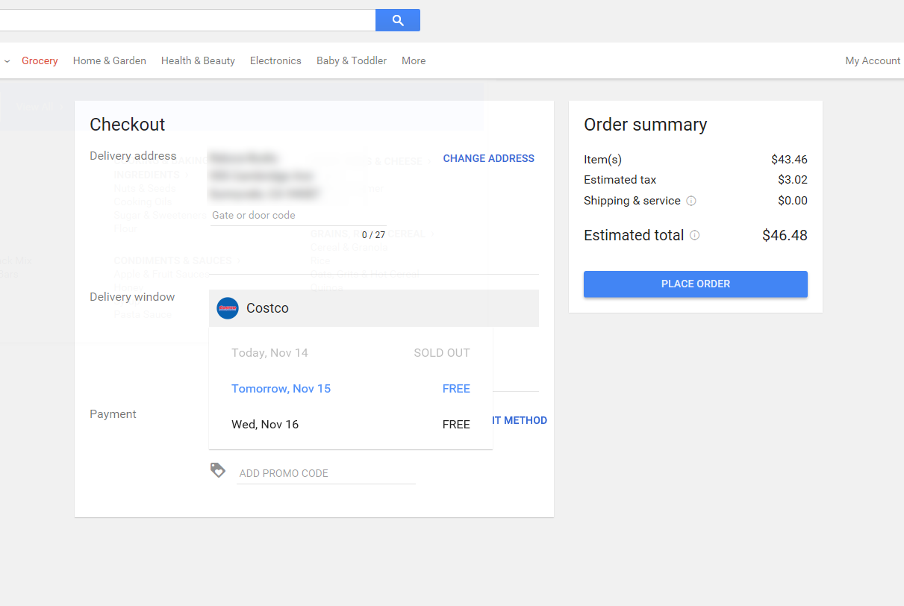

    <em>Google Express는 배송 옵션을 포함한 드롭다운을 제공했습니다. 사용 불가능한 선택은 비활성화되고 회색으로 표시되었습니다.</em>

  * 일반적으로 10개 이상의 날짜가 있는 경우에는 이 방법을 권장하지 않습니다.
  * 날짜 목록을 스캔하고 스크롤하는 것이 번거로울 수 있기 때문입니다.

* 사용자에게 날짜를 서식화하기 위해 특수 문자를 입력하도록 요구하지 마세요.
  * 사용자가 날짜를 입력하는 데 선택한 서식(대시, 공백, 슬래시, 월, 일 및 연도 구성 요소 사이의 점 등)에 관계없이 입력을 인식해야 합니다.
  * 또한, 가장 왼쪽에 있는 0은 날짜에 영향을 주지 않아야 합니다.
  * 아래의 Priceline 예에서 날짜 9-3-17은 거부되었고, 양식 요구 사항이 제출하기 전에 표시되지 않았음에도 불구하고 09/08/17은 허용되었습니다.

  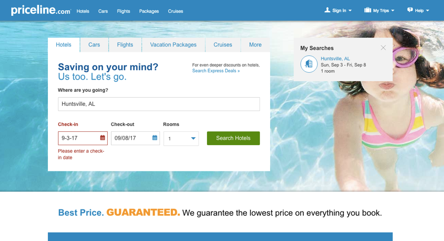

    <em>Priceline은 사용자에게 어떻게 올바르게 서식을 지정해야 하는지 제안조차 제공하지 않은 채 날짜 9-3-17을 거부했습니다. 대신 사용자를 위해 날짜를 허용하고 구문 분석해야 합니다.</em>

* 오류를 적절하게 보고하세요.
  * 사용자가 명백한 실수로 날짜를 입력하는 경우(예: 11/81/17과 같이) 어떤 가정도 하지 마세요.
  * 사용자에게 피드백을 제공하고 오류를 해결하는 방법에 대한 제안을 제공하세요.
* 불합리한 날짜 옵션 제거
  * 사용자가 불합리한 날짜를 선택하지 못하도록 방지하세요.
  * 무엇이 합리적인지는 경우마다 다를 것입니다.
  * 예를 들어, 출생일의 경우 130년 이상된 날짜는 거의 발생하지 않을 것이지만 문서 날짜의 경우 허용될 수 있습니다.
  * 사용자가 귀국일을 출발일보다 이전이나 과거로 선택하지 못하도록 방지하세요.
  * 사용할 수 없거나 불합리한 날짜 옵션을 비활성화하고 회색으로 표시하여 선택 사항을 명확하게 만드세요.
* 사용자의 작업 유지
  * 동일한 날짜 정보가 양식의 별도 부분이나 작업 중 나중에 필요한 경우 사용자가 날짜를 두 번 입력하도록 하지 마세요.
* 날짜 범위 일관성 유지
  * 출발 및 귀국 일치에 대한 날짜 범위를 변경하지 마세요.
  * 예를 들어, 출발에는 11월-12월이 표시되고 귀국 날짜 범위에는 12월-1월이 표시되지 않도록 하세요.
  * 이러한 변경은 간과될 수 있으며 사용자가 의도한 날짜가 예전에 있었던 곳을 클릭하면 실수로 이어질 수 있습니다.

* 국제 사용자를 대상으로 하는 경우, 날짜 형식은 명확하고 이해하기 쉬워야 합니다.
  * 날짜 입력 필드는 문화에 따라 다르며, 다른 형식에 익숙한 사용자에게 큰 문제를 일으킬 수 있습니다.
  * "10/11/2016"은 미국인에게는 2016년 10월 11일을 의미할 수 있지만, 유럽에서 온 사람에게는 11월 10일로 이해될 수 있습니다.
  * 전 세계 대상으로 날짜 입력을 디자인할 때 다음과 같은 지침을 따르세요:
    * 월, 일 및 연도를 분리하고 어떤 필드가 월, 일 및 연도인지 명확히 표시하세요.

  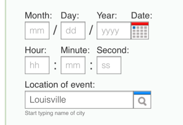

    <em>이 카운트다운 타이머는 날짜 구성 요소를 분리하고 명확하게 레이블을 붙였습니다.
</em>

  * 월의 이름을 글로 쓰세요
    * 월의 이름을 일과 구분하기 위해 글로 쓰세요.

  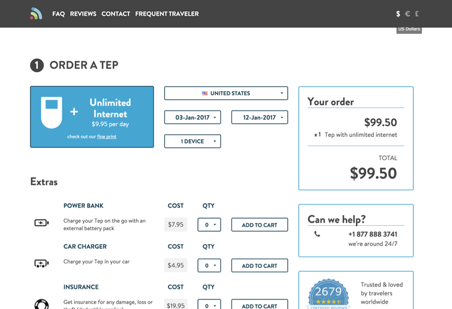

    <em>휴대용 WiFi 장치를 대여할 수 있는 Tep Wireless 사이트에서는 글로 쓴 월의 이름을 사용하여 국제 관객을 지원했습니다.</em>

  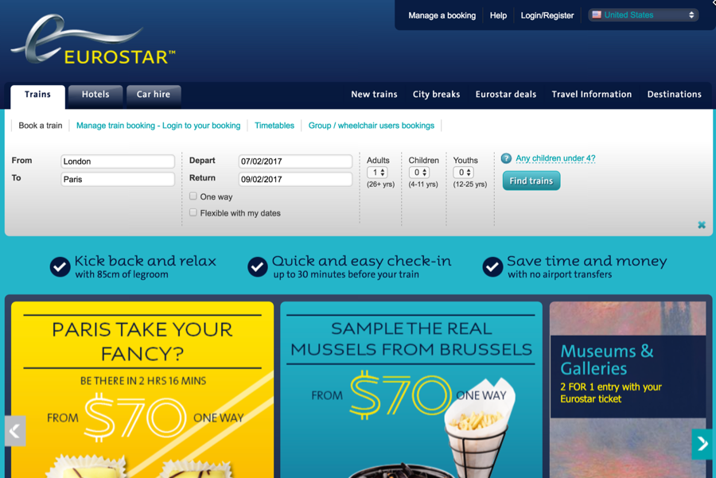

    <em>영어 (미국)으로 표시된 유로스타 웹사이트는 여러 언어를 지원하지만 어떤 날짜 형식을 예상하는지 언급하지 않았습니다. 여기에서 출발 날짜는 7월 2일 또는 2월 7일로 해석될 수 있습니다.</em>

  * 월의 이름이 명확하게 표시된 캘린더 선택기를 활용하세요.
    * Bootstrap과 같은 몇 가지 프레임워크는 명료한 날짜 선택을 지원하기 위해 캘린더 선택기를 제공합니다.

  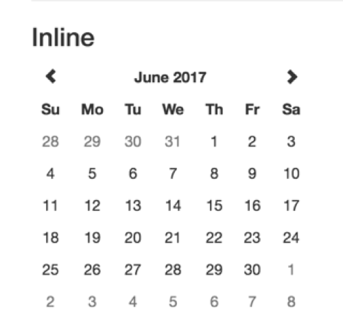

    <em>Bootstrap 캘린더 선택기는 월의 이름을 명확하게 표시하여 어떤 날짜를 선택해야 하는지 알 수 있게 합니다.</em>

  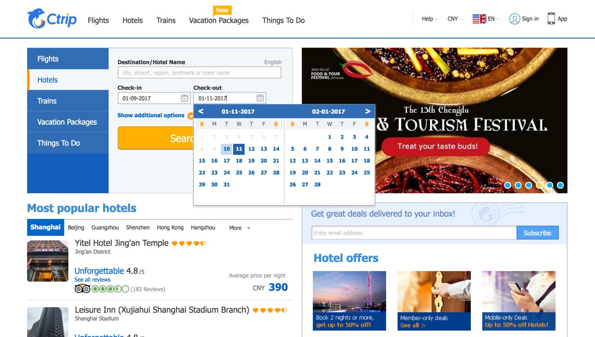

    <em>Ctrip 영문 버전의 캘린더 선택기는 월의 이름을 표시하지 않았습니다. 사용자는 월이 일보다 앞에 있는 것으로 유추해야 했습니다.</em>

## 결론
* 날짜 입력 패턴은 모두 동일하지 않습니다.
* 컨텍스트에 적합한 디자인 패턴을 구현하세요.
* 날짜 입력 필드를 디자인할 때 텍스트 입력을 지원하고 국제적인 관객이 있는지 여부를 고려하세요.
* 모호한 디자인은 사용자가 웹사이트에 짜증을 내거나 포기하게 할 수 있으므로 이러한 가이드라인을 따라 양식 포기와 치명적인 오류를 방지하세요.
***

* 원본 출처: https://www.nngroup.com/articles/date-input/